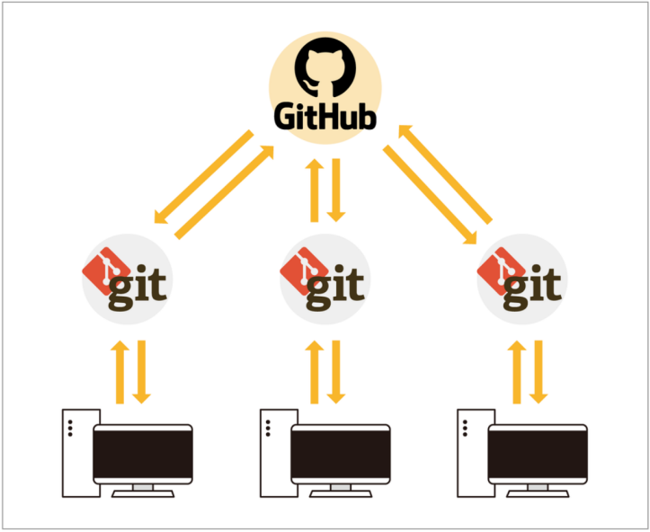
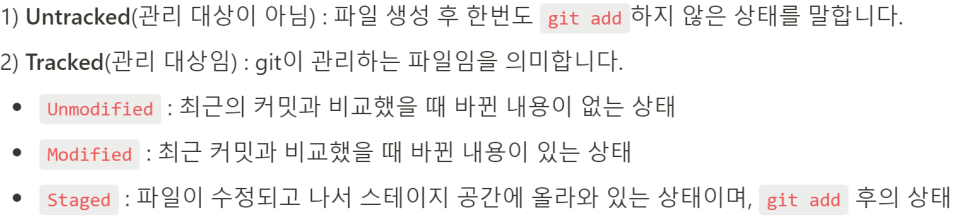
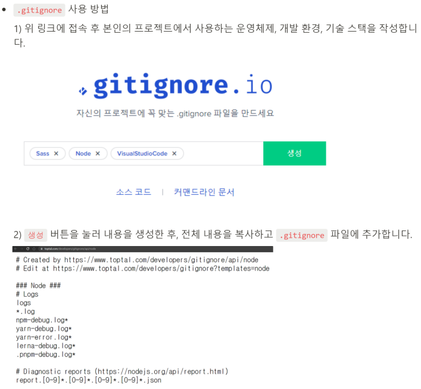
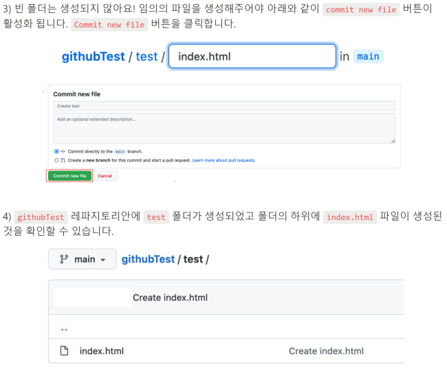

# Git & GitHub 기초 학습 보고서

## 1. 서론
최근 소프트웨어 개발 환경에서는 여러 사람이 동시에 하나의 프로젝트를 개발하는 협업 방식이 일반적이다. 이러한 환경에서는 코드와 문서의 변경 이력을 체계적으로 관리하고, 작업 충돌을 최소화하는 도구가 필수적이다.
본 보고서는 Git과 GitHub의 기본 개념을 학습하고, 실제 사용 흐름과 실습 과정을 정리함으로써 초심자 관점에서 버전 관리와 협업 도구의 활용 방법을 이해하는 것을 목표로 한다.

## 2. Git과 GitHub의 개념
### 2.1 Git의 개념
<p align="center"></p>

- Git은 파일의 변경 이력을 관리하는 분산 버전 관리 시스템(DVCS)으로, 개발자는 Git을 통해 파일의 수정 사항을 기록하고, 이전 상태로 되돌리거나 변경 내역을 비교할 수 있다. 
- Git은 크게 로컬 저장소(내 컴퓨터)와 원격 저장소로 나뉠수 있는데, 만약 코드가 손상되거나 다른 컴퓨터에서 코드를 가져오고 싶을때는 원격저장소를 통해서 가져올수 있다.
- 또한, 코드의 변경 내역또한 가져올수 있기 때문에, Git은 '버전 관리 도구'라고도 할 수 있다.

### 2.2 GitHub의 개념
GitHub는 Git을 기반으로 한 원격 저장소 서비스로, 프로젝트를 온라인에 저장하고 여러 사용자와 협업할 수 있도록 지원한다.

## 3. Git/GitHub의 사용법
### 3.1 Git/GitHub의 핵심 키워드
<p align="left">
  
  
  
  
</p>
pull / add / commit / push 

### 3.2 Git 사용방법
- http://git-scm.com 에서 설치 및 실행
- 버전 확인 및 초기 설정
  ```bash
  $ git --version
  $ git config --global user.name "hongildong"
  $ git config --global user.email email@example.com
  ```
- 작업할 디렉토리(저장소)를 만들고(mkdir) 생성한 디렉토리로 이동하기(cd)
  ```bash
  $ mkdir git-test
  $ cd git-test
  ```
- 해당 디렉토리를 Git저장소로 만들기. git init를 입력하면 해당 폴더 기준으로 .git(로컬 저장소)가 생성됨(한 폴더당 하나의 .git을 가져야함. 아니면 충돌이 발생)
  ```bash
  $ git init
  ```
- 파일을 생성하고, 추가하고 커밋하기
  ```bash
  $ touch README.md // 파일 생성 (파일 상태 = Untracked)
  $ git add README.md // 파일 추가 (파일 상태 = Staged(커밋 후보 선정))
  $ git commit -m // 파일 커밋 (파일 상태 = Commited(Staged된 파일들을 하나의 버전으로 저장. 일종의 체크 포인트))
  ```
- 이때 commited된 코드는 로컬상의 .git 폴더에 저장됨
- 만약 변경사항을 전부 커밋 후보로 올리고 싶다면 add . 사용
  ```bash
  $ git add . // 변경사항 전부 Staged
  ```
-  파일 상태(status)를 확인
  ```bash
  $ git status 
  ```
  <p align="left">
  
  </p>
  
- 변경 사항(diff) 및 커밋 히스토리(log) 확인
  ```bash
  $ git diff
  $ git log 
  ```
- GitHub에 반영(push)되지 않을 파일 지정(.gitignore)
  <p align="left">
  
  </p>


### 3.3 GitHub 사용방법
- GitHub 가입후, Repository 생성(편의를 위해 README file 생성 추천)
  <p align="left">
  
  </p>

- Repository 내부 하위 폴더 생성하기
  <p align="left">
  
  </p>
  <p align="left">
  
  </p>

- GitHub(원격 저장소)상의 코드를 로컬(컴퓨터)에 연결
  ```bash
  $ mkdir filename // 로컬 상에 디렉토리 생성
  $ cd filename // 해당 디렉토리로 이동
  $ git http://github.com/id/clone-filename.git . // 해당 디렉토리에 받고 싶은 코드 주소 설정([.]: 현 폴더에 배려받기)
  ```
  
- 1) pull: GitHub상에 연결된 Repository에서 업데이트된 데이터 가져오기
  ```bash
  $ git pull origin main
  ```
- 2)
  

## 4. Git 기본 명령어
```bash
git init
git status
git add .
git commit -m "first commit"
git push
```

## 5. 파일 상태 관리
Untracked, Modified, Staged, Committed 상태를 통해 변경 이력을 관리한다.

## 6. .gitignore
버전 관리가 필요 없는 파일을 제외하여 협업 시 불필요한 충돌을 방지한다.

## 7. GitHub 협업 기능
Collaborators 기능을 통해 팀원을 저장소에 초대할 수 있다.

## 8. Git 로그 관리
```bash
git log
git log --graph --pretty=oneline
```

## 9. GitHub Pages
Repository를 웹 페이지 형태로 배포할 수 있는 기능이다.

## 10. Mermaid 문서화
Markdown 문서 내에서 텍스트 기반 다이어그램 작성을 지원한다.

## 11. 결론
Git은 버전 관리 도구이며, GitHub는 협업과 공유를 위한 플랫폼이다.
