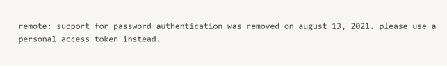

# Git & GitHub 기초 학습 보고서

## 1. 서론
최근 소프트웨어 개발 환경에서는 여러 사람이 동시에 하나의 프로젝트를 개발하는 협업 방식이 일반적이다. 이러한 환경에서는 코드와 문서의 변경 이력을 체계적으로 관리하고, 작업 충돌을 최소화하는 도구가 필수적이다.
본 보고서는 Git과 GitHub의 기본 개념을 학습하고, 실제 사용 흐름과 실습 과정을 정리함으로써 초심자 관점에서 버전 관리와 협업 도구의 활용 방법을 이해하는 것을 목표로 한다.

## 2. Git과 GitHub의 개념
### 2.1 Git의 개념
<p align="center"></p>

- Git은 파일의 변경 이력을 관리하는 분산 버전 관리 시스템(DVCS)으로, 개발자는 Git을 통해 파일의 수정 사항을 기록하고, 이전 상태로 되돌리거나 변경 내역을 비교할 수 있다. 
- Git은 크게 로컬 저장소(내 컴퓨터)와 원격 저장소로 나뉠수 있는데, 만약 코드가 손상되거나 다른 컴퓨터에서 코드를 가져오고 싶을때는 원격저장소를 통해서 가져올수 있다.
- 또한, 코드의 변경 내역또한 가져올수 있기 때문에, Git은 '버전 관리 도구'라고도 할 수 있다.

### 2.2 GitHub의 개념
GitHub는 Git을 기반으로 한 원격 저장소 서비스로, 프로젝트를 온라인에 저장하고 여러 사용자와 협업할 수 있도록 지원한다.

## 3. Git/GitHub의 사용법
### 3.1 Git/GitHub의 핵심 키워드
<p align="left">
  
  
  
  
</p>
pull / add / commit / push 

### 3.2 Git 사용방법
- http://git-scm.com 에서 설치 및 실행
- 버전 확인 및 초기 설정
  ```bash
  git --version
  git config --global user.name "hongildong"
  git config --global user.email email@example.com
  ```
- 작업할 디렉토리(저장소)를 만들고(mkdir) 생성한 디렉토리로 이동하기(cd)
  ```bash
  mkdir git-test
  cd git-test
  ```
- 해당 디렉토리를 Git저장소로 만들기. git init를 입력하면 해당 폴더 기준으로 .git(로컬 저장소)가 생성됨(한 폴더당 하나의 .git을 가져야함. 아니면 충돌이 발생)
  ```bash
  git init
  ```
- 파일을 생성하고, 추가하고 커밋하기
  ```bash
  touch README.md // 파일 생성 (파일 상태 = Untracked)
  git add README.md // 파일 추가 (파일 상태 = Staged(커밋 후보 선정))
  git commit -m // 파일 커밋 (파일 상태 = Commited(Staged된 파일들을 하나의 버전으로 저장. 일종의 체크 포인트))
  ```
- 이때 commited된 코드는 로컬상의 .git 폴더에 저장됨
- 만약 변경사항을 전부 커밋 후보로 올리고 싶다면 add . 사용
  ```bash
  git add . // 변경사항 전부 Staged
  ```
-  파일 상태(status)를 확인
  ```bash
  git status 
  ```
  <p align="left">
  
  </p>
  
- 변경 사항(diff) 및 커밋 히스토리(log) 확인
  ```bash
  git diff
  git log 
  ```
- GitHub에 반영(push)되지 않을 파일 지정(.gitignore)
  <p align="left">
  
  </p>


### 3.3 GitHub 사용방법
- GitHub 가입후, Repository 생성(편의를 위해 README file 생성 추천)
  <p align="left">
  
  </p>

- Repository 내부 하위 폴더 생성하기
  <p align="left">
  
  </p>
  <p align="left">
  
  </p>

- GitHub(원격 저장소)상의 코드를 로컬(컴퓨터)에 연결
  ```bash
  mkdir filename // 로컬 상에 디렉토리 생성
  cd filename // 해당 디렉토리로 이동
  git http://github.com/id/clone-filename.git . // 해당 디렉토리에 받고 싶은 코드 주소 설정([.]: 현 폴더에 배려받기)
  ```
  
- 1) pull: GitHub상에 연결된 Repository에서 업데이트된 데이터 가져오기
  ```bash
  git pull origin main
  ```
- 2) add: 로컬(내 컴퓨터)에서 수정·추가된 파일을 커밋 대상으로 선택하여 스테이징 영역(Staging Area)에 올리기
  ```bash
  git add .
  ```
- 3) commit: 스테이징된 변경사항을 하나의 버전(이력)으로 로컬 저장소에 기록하기
  ```bash
  git commit -m "Update study contents"
  ```
- 4) push: 로컬 저장소에 기록된 커밋을 GitHub(원격 저장소)로 업로드하여 팀원과 공유하기
  ```bash
  git push origin main
  ```
  -> 하지만, push시 아래와 같은 오류가 생길수 있다. 이와 같은 경우, 비밀번호 대신 token이나 SSH중 하나로 인증을 진행해야 한다
  <p align="left">
  
  </p>
  

## 4. Token/SSH 사용방법
### 4.1 Token
- token 발급
  1) GitHub상단의 개인 프로필에서 Settings 클릭
  2) 좌측 메뉴에서 Developer settings > Peosonal access token > Generate new token을 클릭
  3) 비밀번호를 입력한 후, 토큰을 생성한다. 토큰이름과 허가할 권한을 체크한 후에 Generate token을 클릭한다.
  4) 생성한 토큰을 복사하고 필요한 곳에 사용한다. 이때 토큰은 한번만 보여지기 때문에 안전한 곳에 보관한다. 발급된 토큰은 부여된 권한만 볼 수 있다.
  5) 재발급을 원하는 경우에는 재발급을 하고자 하는 토큰을 클릭 후, Regenerate token을 클릭하면 토큰이 재생성 된다.
  6) 토큰 발급이 완료되면 운영체제에 맞게 적용시킨다.
  <p align="left">
  
  </p>
     
### 4.2 SSH Key 생성 및 등록

- SSH(Secure Shell)는 네트워크상에서 컴퓨터에 안전하게 접속하고 원격으로 명령을 실행하거나 파일을 전송할 수 있게 해주는 보안 통신 프로토콜이다.
- 이 SSH Key(Public)을 Github에 등록하여, 내 로컬 서버가 Github 서버의 데이터를 읽고 쓸 수 있는 권한을 얻게 됩니다.

1) SSH 키생성
```bash
ssh-keygen -t ed25519 -C "your-github-email"
```
  `-t` : `ed25519` 암호화 타입 지정
  `-C` : `your-github-email` 이 작성된 부분을 대체

2) SSH 키(public) 확인 및 복사
```bash
cat ~/.ssh/id_ed25519.pub
```
>이 커맨드라인 실행 후 나오는 문자열을 복사한다.
>> 참고: 리눅스 기준 /home/user/.ssh 폴더에 ssh key가 생성되는데, 이때 파일이 두 개 생성된 걸 확인할 수 있다. 이때 `.pub` 확장자가 붙은 파일에 있는 공개키를 등록해주어야 한다.

3) Github에 SSH 키 등록
* [이 문서](https://www.google.com/search?q=https://github.com/KennethanCeyer/tutorial-git%3Ftab%3Dreadme-ov-file%23lock-ssh)를 참고

4) SSH 키가 잘 등록되었는지 확인
```bash
ssh -T git@github.com
```
```bash
git init
git status
git add .
git commit -m "first commit"
git push
```

## 5. Branch를 통한 작업환경 관리
- 보통 여러 명의 개발자가 협업을 하기 때문에 서로의 변경사항이 겹치거나 충돌되지 않게 Branch로 공간을 나누어 작업한다.
- 예를 들어 누군가는 로봇의 센서의 오류를 수정하는 업무를, 누군가는 로봇의 비전 AI 모델을 개선하는 업무를 해야 할 때 각자 Branch를 나누어 작업하면 각자 독립적인 작업 영역을 보장할 수 있다.
- 또한 실제 서비스되고 있는 프로덕션 환경에 바로 작업 내용이 반영되지 않고 충분한 코드 리뷰를 거치기 위해서도 별도의 Branch를 생성하여 작업한다.
- 아래는 기본적인 용어를 정리한 것이다.
  * **Branch**: 별도의 작업 공간
  * **Merge**: 두 개의 Branch를 합쳐 하나로 만드는 행위이다. 예컨대 A Branch에서 로봇 센서 오류를 수정한 내용을 Origin에 Push하면, Origin의 Main Branch에서 Merge하여 실제 서비스되고 있는 환경에 수정된 내용을 반영한다.

아래 내용은 이런 작업 과정에 필요한 명령어(커맨드라인)를 정리한 내용이다.

### 5.1. Branch 생성 및 변경

  (1) 작업할 Branch 생성
  ```bash
  git checkout -b your-branch-name
  
  ```
  * `your-branch-name` 자리에 내가 설정하고 싶은 Branch 이름을 넣습니다. Gemini에 물어본 결과, 기능을 알 수 있게 이름을 구성한다고 하네요. Github의 repository에 있는 다른 Branch와 이름이 겹치지 않게 설정해야 합니다.


  (2) 현재 내가 작업 중인 Branch 상태 확인
  ```bash
  git status
  ```
  * 현재 내가 작업 중인 Branch와 아직 Commit 되지 않은 변경 내용을 확인할 수 있다.

  (3) 다른 Branch로 이동
  ```bash
  git checkout your-branch-name
  ```
  * 내가 작업 중인 Branch를 변경하고 싶을 때 이 커맨드라인을 사용합니다.

### 5.2. Commit 생성 및 변경

  (1) 모든 변경사항을 Staged 단계로 이동
  
  ```bash
  git add .
  ```


  (2) 현재 Staged 단계의 changes를 하나의 Commit으로 합치기
  
  ```bash
  git commit -m "your-commit-message"
  
  ```
  
  * 참고로 Cursor 에디터에서는 commit message를 자동으로 만들어주는 기능이 있습니다.
  
  (3) Commit 되돌리기 (Reset vs Revert)
  작업을 되돌리는 방법은 크게 두 가지가 있으며, **이미 원격 저장소(Github)에 Push 했는지 여부**가 가장 중요하다.
  
  - 1) 원격 저장소에 Push 하지 않은 경우 (Local 작업)
  나만 알고 있는 로컬의 기록을 지우는 것이므로 `reset` 을 사용하여 과감하게 되돌릴 수 있다.
  ```bash
  # 가장 최신 commit을 취소하고, 변경 내용은 작업 공간(Working directory)에 보존 (가장 많이 씀)
  git reset --soft HEAD~1
  
  # 가장 최신 commit을 취소하고, 변경 내용까지 모두 삭제 (주의 필요)
  git reset --hard HEAD~1
  ```
  * `HEAD~1` 은 현재 시점(HEAD)에서 1단계 뒤로 간다는 뜻입니다. (즉, 방금 한 Commit 취소)
  
  - 2) 원격 저장소에 이미 Push 한 경우 (협업 중)
  이미 Github에 올라간 Commit을 `reset` 으로 강제 삭제하면, 동료들의 코드와 꼬이게 된다. 이때는 "취소했다는 새로운 Commit"을 생성하는 `revert` 를 써야 한다.
  ```bash
  git revert commit-id
  ```
  
  * `commit-id`: 되돌리고 싶은 특정 Commit의 ID입니다. (예: `a1b2c3d`)
  * 이 명령어를 실행하면 *"Revert ... commit-name"* 이라는 새로운 Commit이 생성되며, 코드는 이전 상태로 돌아가지만 기록은 안전하게 남습니다.

### 5.3. 로컬의 Commit들을 Github의 Origin branch 로 올리기

```bash
git push origin your-branch-name

```

* 지금까지 작업한 내용(Commit)을 작업 중인 로컬 Branch에서 Github의 Origin Branch로 올려 최신화하는 커맨드라인입니다.
* Push 이후 작업자는 Github의 Repository 에서 Pull Request를 하여, 다른 작업자들에게 '내 작업 내용을 프로덕션에 반영해줘'라는 요청을 올리게 됩니다.

```bash
git push origin main

```

* 만약 내가 작업 중인 Branch의 origin이 아니라, main의 origin에 올리게 되면 내가 작업한 내용이 자동으로 main에 적용되게 됩니다.
* 보통은 권한이 있는 작업자만 origin의 main Branch에 작업 내용을 반영할 수 있게 설정합니다.
